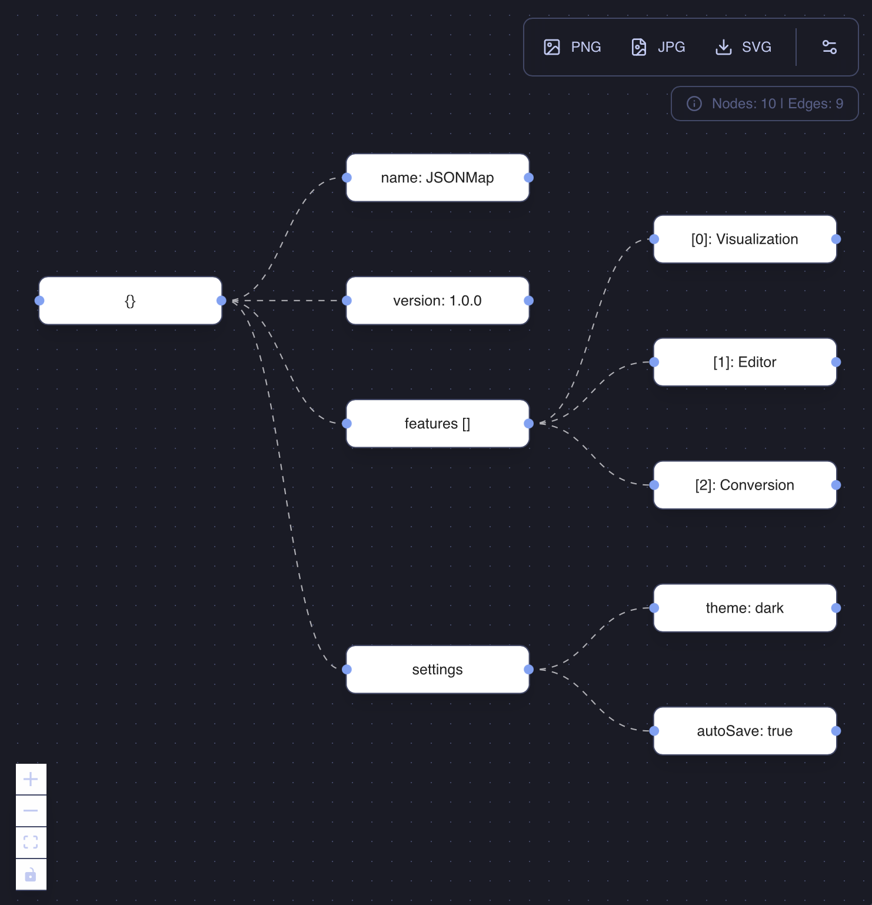
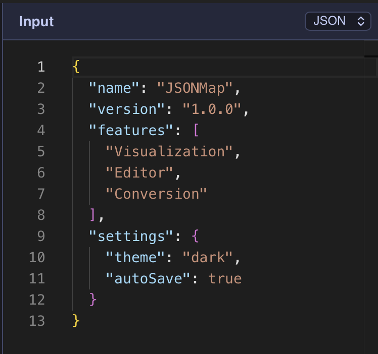

# JSONMap

<div align="center">
  
  <h1>JSONMap</h1>
  <p>
    <strong>A high-performance, native macOS visualizer for JSON, YAML, XML, TOML, and CSV.</strong>
  </p>

  [](https://github.com/JSONMap/JSONMap/releases)
  [](LICENSE)
  [](https://github.com/JSONMap/JSONMap/releases)
  [](https://github.com/JSONMap/JSONMap/releases)
</div>

<br />

<div align="center">
  <a href="https://github.com/JSONMap/JSONMap/releases/latest">
    
  </a>
</div>

<br />

> **JSONMap** is a developer-first tool designed to make navigating complex data structures intuitive and fast. Built with **Tauri (Rust)** and **React**, it combines native performance with a modern, beautiful UI.

## ✨ Features

- **🚀 Multi-Format Support**: Instantly parse and visualize **JSON**, **YAML**, **XML**, **TOML**, and **CSV**.
- **🕸️ Interactive Graph**: Navigate deep hierarchies with a zoomable, node-based graph view.
- **🔒 Privacy First**: All processing happens **locally**. Your data never leaves your machine.
- **🛠️ Power Tools**:
    - **JQ Querying**: Filter and transform data using JQ syntax.
    - **JWT Decoder**: Inspect tokens without external websites.
    - **Anonymizer**: Mask PII/sensitive data with one click.
    - **Code Generation**: Generate TypeScript, Go, Rust, and Python types from your JSON.
- **🎨 Native Experience**:
    - Dark/Light mode support.
    - Native macOS vibrancy and blur effects.
    - Keyboard shortcuts for efficiency.

## 📸 Screenshots

| Visualizer Graph | Editor & Tools |
|:---:|:---:|
|  |  |

*(Note: Screenshots are placeholders. Please add `graph-view.png` and `editor-view.png` to `docs/screenshots/`)*

## 📥 Installation

1. Go to the [Releases page](https://github.com/JSONMap/JSONMap/releases).
2. Download the latest `.dmg` file (`JSONMap_x64.dmg` or `JSONMap_aarch64.dmg`).
3. Open the `.dmg` and drag **JSONMap** to your **Applications** folder.

## 🏗️ Development

Prerequisites:
- [Rust](https://www.rust-lang.org/tools/install)
- [Node.js](https://nodejs.org/) (v18+)
- [pnpm](https://pnpm.io/)

```bash
# Clone the repository
git clone https://github.com/JSONMap/JSONMap.git
cd JSONMap

# Install dependencies
pnpm install

# Run in development mode
pnpm tauri dev

# Build for production
pnpm tauri build
```

## 🤝 Contributing

Contributions are welcome! Please feel free to submit a Pull Request.

## 📄 License

This project is licensed under the **MIT License** - see the [LICENSE](LICENSE) file for details.

## ❤️ Author

Built with passion by **[Alexandre Enouf (Boblebol)](https://github.com/Boblebol)**.
