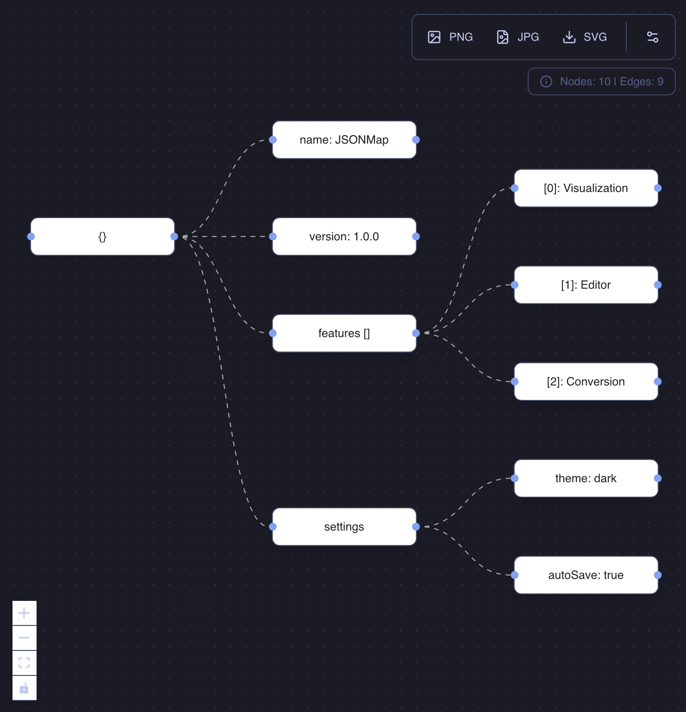
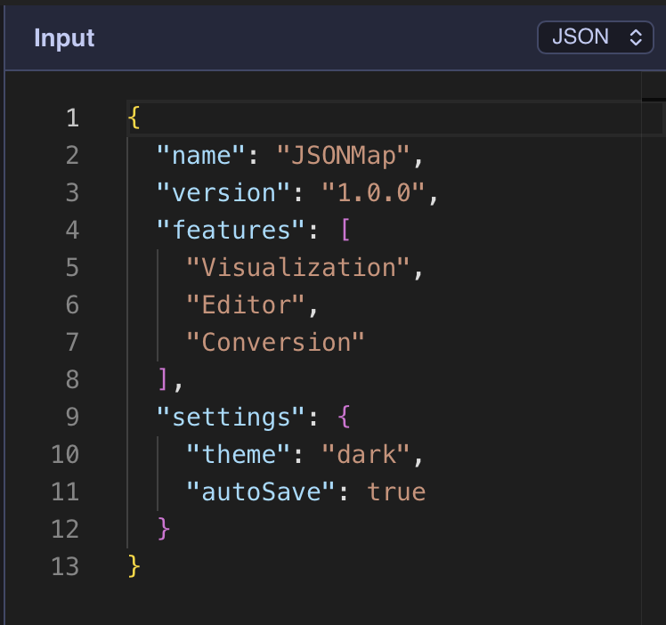

# JSONMap

<div align="center">
  
  <h1>JSONMap</h1>
  <p>
    <strong>A local-first desktop workspace for visualizing, editing, versioning, converting, and generating code from structured data.</strong>
  </p>

  [](https://github.com/Boblebol/JSONMap/actions/workflows/ci.yml)
  [](https://github.com/Boblebol/JSONMap/releases)
  [](LICENSE)
  [](https://github.com/Boblebol/JSONMap/releases)
  [](https://github.com/Boblebol/JSONMap/releases)
  
  **[Live Demo & Documentation](https://boblebol.github.io/JSONMap/)**
</div>

<br />

<div align="center">
  <a href="https://github.com/Boblebol/JSONMap/releases/latest">
    
  </a>
</div>

<br />

> **JSONMap** is a local-first structured data workspace designed for both non-technical users and developers. Drop a file, explore it as a graph, edit safely, keep snapshots, convert formats, and generate typed descriptors without sending private data to an online service.

## ✨ Features

- **🚀 Multi-Format Support**: Open, edit, convert, and export **JSON**, **YAML**, **XML**, **TOML**, and **CSV**.
- **📂 In-Memory Workspace**: Drag and drop local files, switch between documents, reset to the original version, and export modified copies.
- **🕸️ Interactive Graph**: Navigate deep hierarchies with a zoomable graph, search nodes, and expand or collapse branches.
- **✍️ Safe Editing**: Edit JSON scalar values from the inspector, copy JSONPath values, copy or export subtrees, and keep raw content visible.
- **🧾 Versioning and Diff**: Create named snapshots, restore previous versions, export snapshots, and compare changes.
- **🔒 Privacy First**: All processing happens **locally**. Your data never leaves your machine.
- **🛠️ Developer Tools**:
    - **JQ and JSONPath**: Query the active document, copy results, or create result documents.
    - **Format Conversion**: Convert the active document into JSON, YAML, TOML, XML, or CSV.
    - **JWT Decoder**: Inspect tokens without external websites.
    - **Anonymizer**: Mask PII/sensitive data with one click and save a redacted snapshot.
    - **JSON Schema**: Infer schemas, validate the active JSON, and create `.schema.json` workspace documents.
    - **Code Generation**: Create TypeScript, Python dataclass, Pydantic v2, Go, and Rust serde documents from JSON.
- **🎨 Native Experience**:
    - Dark/Light mode support.
    - Native macOS vibrancy and blur effects.
    - Keyboard shortcuts for efficiency.

## Current Roadmap Status

The v1.7 code generation milestone is implemented:

- TypeScript interfaces as `.ts` documents.
- Python dataclasses as `.py` documents.
- Pydantic v2 models as `.pydantic.py` documents.
- Go structs as `.go` documents.
- Rust serde structs as `.rs` documents.
- JSON Schema inference and validation as `.schema.json` documents.
- Stable fixture snapshots for generated TypeScript, Python, Pydantic, Go, and Rust output.

Next focus: v1.8 performance work, starting with moving parsing off the React render path and improving large-file graph rendering.

## 📸 Screenshots

| Visualizer Graph | Editor & Tools |
|:---:|:---:|
|  |  |

## 📥 Installation

1. Go to the [Releases page](https://github.com/Boblebol/JSONMap/releases).
2. Download the latest `.dmg` file (`JSONMap_x64.dmg` or `JSONMap_aarch64.dmg`).
3. Open the `.dmg` and drag **JSONMap** to your **Applications** folder.

> [!IMPORTANT]
> **MacOS Security Note**: Since the app is currently unsigned, you might see a warning that the "app is damaged" or cannot be opened. To fix this, run the following command in your terminal:
> ```bash
> xattr -cr /Applications/JSONMap.app
> ```

## 🏗️ Development

Prerequisites:
- [Rust](https://www.rust-lang.org/tools/install)
- [Node.js](https://nodejs.org/) (v18+)
- [pnpm](https://pnpm.io/)

```bash
# Clone the repository
git clone https://github.com/Boblebol/JSONMap.git
cd JSONMap

# Install dependencies
pnpm install

# Run in development mode
pnpm tauri dev

# Run the web shell only
pnpm run dev

# Run frontend tests
pnpm test --run

# Run backend tests
cd src-tauri
cargo test --locked

# Build for production
pnpm tauri build
```

## Verification

Before opening a pull request or cutting a release candidate, run:

```bash
pnpm test --run
pnpm run build
cd src-tauri && cargo test --locked
```

The current frontend build emits a Vite chunk-size warning because Quicktype is bundled for in-app code generation. That warning is tracked as future performance work; it is not currently a build failure.

## 🤝 Contributing

Contributions are welcome! Please check our [Contributing Guidelines](CONTRIBUTING.md) and see the [Code of Conduct](CODE_OF_CONDUCT.md).

## 📄 License

This project is licensed under the **MIT License** - see the [LICENSE](LICENSE) file for details.

## ❤️ Author

Built with passion by **[Alexandre Enouf](https://alexandre-enouf.fr/)**.
Check out my other projects on [GitHub](https://github.com/Boblebol).
